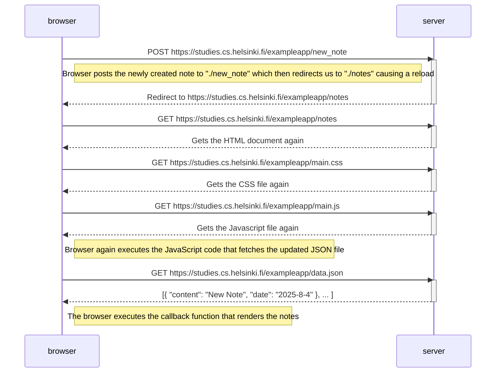

```mermaid

sequenceDiagram
    participant browser
    participant server

    browser->>server: POST https://studies.cs.helsinki.fi/exampleapp/new_note
    activate server

    Note right of browser: Browser posts the newly created note to "./new_note" which then redirects us to "./notes" causing a reload

    server-->>browser: Redirect to https://studies.cs.helsinki.fi/exampleapp/notes
    deactivate server

    browser->>server: GET https://studies.cs.helsinki.fi/exampleapp/notes
    activate server
    server-->>browser: Gets the HTML document again
    deactivate server

    browser->>server: GET https://studies.cs.helsinki.fi/exampleapp/main.css
    activate server
    server-->>browser: Gets the CSS file again
    deactivate server

    browser->>server: GET https://studies.cs.helsinki.fi/exampleapp/main.js
    activate server
    server-->>browser: Gets the Javascript file again
    deactivate server

    Note right of browser: Browser again executes the JavaScript code that fetches the updated JSON file

    browser->>server: GET https://studies.cs.helsinki.fi/exampleapp/data.json
    activate server
    server-->>browser: [{ "content": "New Note", "date": "2025-8-4" }, ... ]
    deactivate server

    Note right of browser: The browser executes the callback function that renders the notes
```